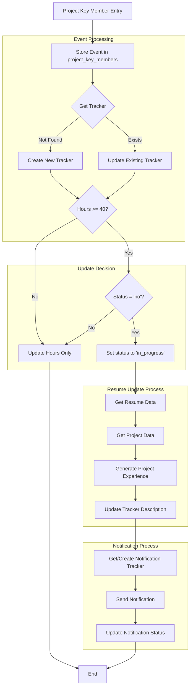
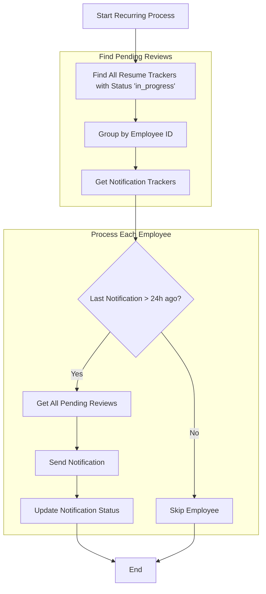
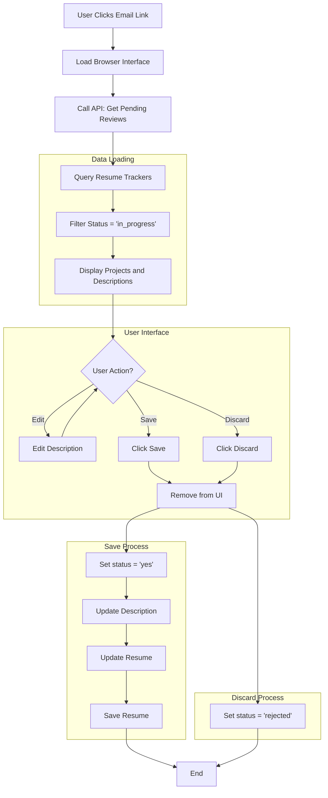

# Resume Update System Requirements

## Overview
A system to automatically generate and manage resume updates based on project work hours, with user review capabilities and notification management.

## Core Components

### 1. Resume Update Tracking
- Track project hours against a 40-hour threshold
- Generate AI-powered project descriptions when threshold is met
- Status tracking:
  - "no" (initial)
  - "in_progress" (description generated)
  - "yes" (approved)
  - "rejected" (discarded)

### 2. Notification System
#### Data Model
- Separate notification tracker entity from resume update tracker
- Notification tracker fields:
  ```json
  {
    "id": "emp456",  // employee_id as id
    "partitionKey": "notifications",
    "type": "notification_tracker",
    "employee_id": "emp456",
    "employee_display_name": "Smith, John - emp456",
    "last_notification_date": "2024-03-15T10:00:00Z",
    "notification_attempts": 3,
    "notification_status": "sent"  // pending, sent, failed
  }
  ```

#### Notification Logic
- Immediate notification when new description is generated
- Recurring notification process for pending reviews
- 24-hour minimum interval between notifications
- Notifications consolidated per employee (not per project)

### 3. User Review Interface
#### Layout & Features
- Dark theme with blue and green brand colors
- Project cards showing:
  - Project name and code in green header
  - Editable text area for full project experience
  - Individual discard buttons per project
  - Single save button for all projects
- Inactive "Tips" button in top right
- Centered "Work Experience" header

#### Project Content
- Single editable text area containing:
  - Project name
  - Project details
  - Achievements and metrics
- Construction-themed sample content
- Two projects displayed at a time

#### User Actions
- Edit project descriptions directly
- Discard individual projects
- Save all projects at once
- Download updated resume (post-save)

### 4. State Management
#### Save Flow
1. User edits and saves
2. Backend processes updates
3. Shows success screen
4. Offers resume download option

#### Discard Flow
1. User clicks discard
2. Updates backend status
3. Shows discard confirmation
4. Removes from UI

## Technical Details
### Frontend
- React application
- Tailwind CSS for styling
- Lucide icons
- Dark theme colors:
  - Background: #111827
  - Container: #1F2937
  - Text areas: #111827
  - Brand blue: #3B82F6
  - Brand green: #22C55E

### Backend Integration
- API endpoints needed:
  - GET pending reviews
  - POST save updates
  - POST discard project
  - GET resume download

## Future Considerations
- Implement resume formatting guidance modal
- Add loading states during API calls
- Error handling UI
- Enhanced validation


[Previous sections remain the same until System Architecture]

## System Workflows

### 1. Main Processing Flow


#### Process Steps
1. **Event Ingestion**
   - Receive Project Key Member entry
   - Validate input data format
   - Extract employee and project information

2. **Event Processing**
   - Store event in project_key_members container
   - Retrieve or create resume tracker
   - Update tracker with latest information
   
3. **Update Decision Logic**
   - Check if total hours ≥ 40
   - Verify current tracker status
   - Determine if resume update needed
   
4. **Resume Update Process**
   - Fetch current resume data
   - Gather project details
   - Generate project experience description
   - Update tracker with new description

5. **Notification Process**
   - Create/update notification tracker
   - Send immediate notification
   - Record notification status

### 2. Recurring Notification Flow


#### Process Steps
1. **Pending Review Collection**
   - Query all 'in_progress' resume trackers
   - Group updates by employee
   - Retrieve notification history

2. **Notification Eligibility**
   - Check 24-hour cooldown period
   - Verify notification attempts count
   - Evaluate priority based on pending time

3. **Notification Processing**
   - Consolidate multiple pending reviews
   - Generate notification content
   - Send notifications
   - Update tracking status

### 3. User Review Flow


#### Process Steps
1. **Initial Load**
   - User accesses review interface
   - Authentication validation
   - Load pending reviews

2. **Data Presentation**
   - Query resume trackers
   - Filter for 'in_progress' status
   - Render project cards

3. **User Interactions**
   - Edit project descriptions
   - Save updates
   - Discard projects
   - Download resume

4. **Save Process**
   - Update tracker status to 'yes'
   - Store modified description
   - Update resume document
   - Confirm changes

5. **Discard Process**
   - Update tracker status to 'rejected'
   - Remove from UI
   - Log rejection reason (future enhancement)

### Implementation Details

#### Event Processing
```python
def process_key_member(member_entry):
    # Store event
    stored_event = _store_event(member_entry)
    
    # Get/create tracker
    tracker = _get_or_create_tracker(member_entry)
    
    # Check update trigger
    if _should_trigger_update(tracker):
        tracker = _trigger_draft_creation(tracker)
```

#### Notification Processing
```python
def process_notifications():
    # Find pending reviews
    pending_reviews = get_pending_reviews()
    
    # Group by employee
    grouped_reviews = group_by_employee(pending_reviews)
    
    for employee_id, reviews in grouped_reviews.items():
        if should_notify(employee_id):
            send_consolidated_notification(reviews)
```

#### User Interface Logic
```javascript
const handleSave = async (descriptions) => {
    // Update UI immediately
    setLoading(true);
    
    // Process each description
    for (const desc of descriptions) {
        await updateTracker({
            status: 'yes',
            description: desc
        });
    }
    
    // Refresh view
    await loadPendingReviews();
    setLoading(false);
};
```

[Rest of the document remains the same...]