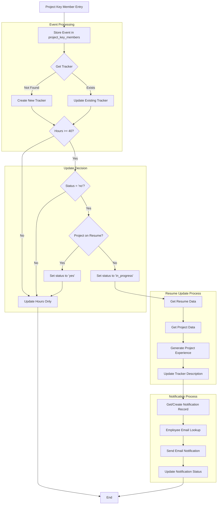
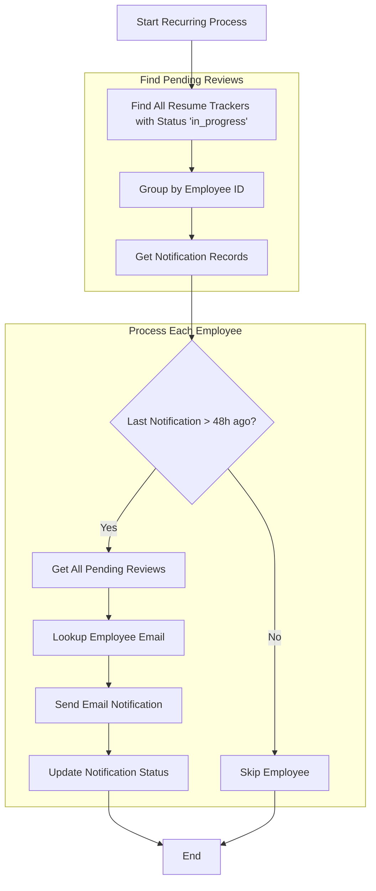
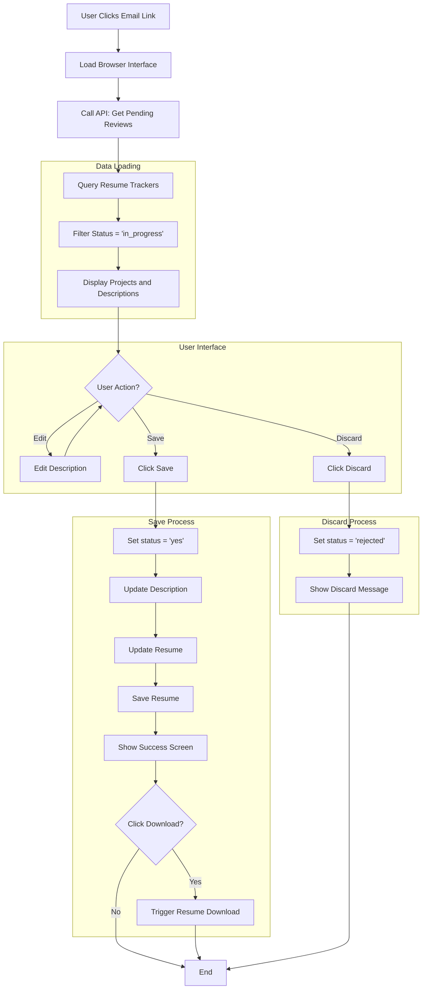
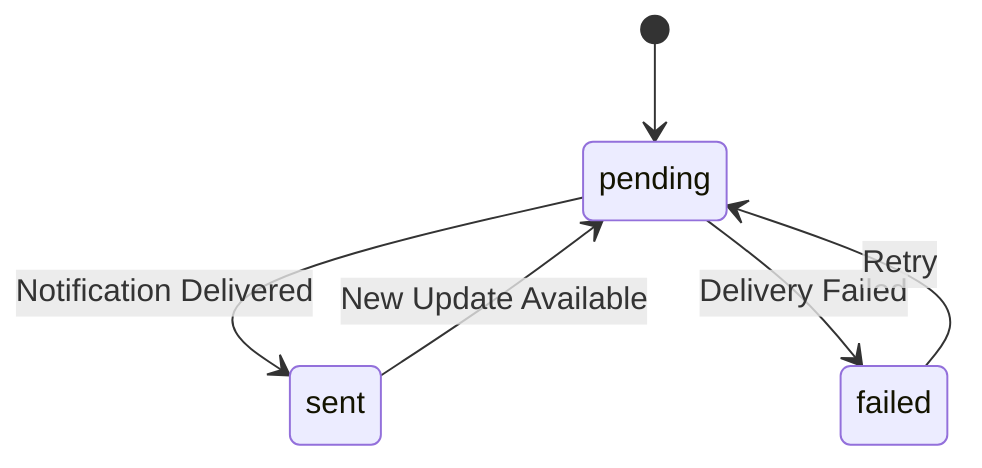
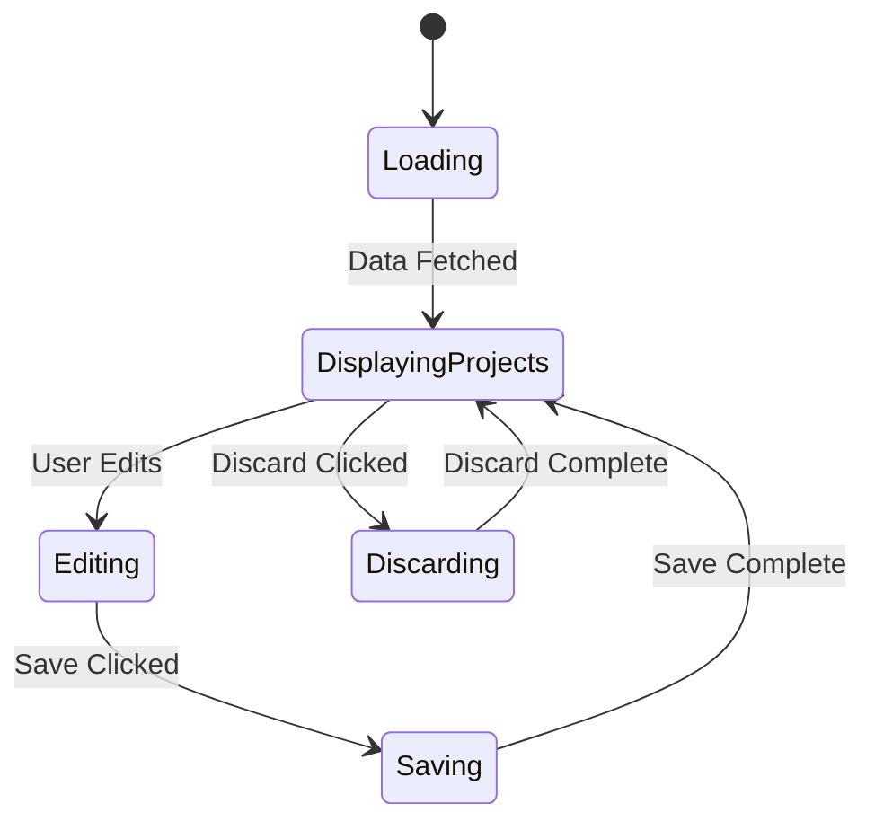

# Resume Update System Design Document

## Overview
A system to automatically generate and manage resume updates based on project work hours, with user review capabilities and notification management. The system tracks employee project participation and generates AI-powered resume updates when significant involvement thresholds are met.

## System Architecture

### 1. Data Storage (Azure Cosmos DB)
- **Databases:**
  - ResumeAutomation
    - Containers:
      - project_key_members (Events)
      - resume_trackers (State Management)
      - notifications (Notification History)
      - employee_metadata (Employee Metadata)

- **Key Data Models:**
  ```json
  // Event Document
  {
    "id": "uuid",
    "partitionKey": "<project_number>",
    "type": "project_key_member",
    "subject_area": "string",
    "project_number": "string",
    "project_role_name": "string",
    "employee_display_name": "string",
    "employee_id": "string",
    "job_hours": "number",
    "employee_job_family_function_code": "string",
    "timestamp": "datetime"
  }

  // Resume Tracker Document
  {
    "id": "<project_number>-<employee_id>",
    "partitionKey": "resumeupdatestatus",
    "type": "resume_update_tracker",
    "employee_id": "string",
    "employee_display_name": "string",
    "project_number": "string",
    "subject_area": "string",
    "total_hours": "number",
    "added_to_resume": "no|in_progress|yes|rejected",
    "description": "string",
    "created_timestamp": "datetime",
    "last_updated": "datetime",
    "version": "number",
    "role_history": [{
      "role_name": "string",
      "job_family_code": "string",
      "start_date": "datetime",
      "end_date": "datetime|null"
    }],
    "review_date": "datetime"
  }

  //Notifications Document
  {
    "id": "notification-67890",
    "partitionKey": "notifications",
    "employee_id": "67890",
    "last_notification": "2024-11-12T16:15:18.108287",
  }

  // Employee Metadata Document
  {
    "id": "metadata-<employee_id>",
    "partitionKey": "metadata",
    "employee_id": "string",
    "email": "string",
    "name": "string",
    "department": "string"
  }

  ```


## System Workflows

### 1. Main Processing Flow



#### Process Steps
1. **Event Ingestion**
   - Receive Project Key Member entry
   - Validate input data format
   - Extract employee and project information

2. **Event Processing**
   - Store event in project_key_members container
   - Retrieve or create resume tracker
   - Update tracker with latest information
   
3. **Update Decision Logic**
   - Check if total hours ≥ HOURS_THRESHOLD. If no, exit.
   - If yes, check if "added_to_resume" field in tracker = "no". If it is any other value, exit. 
   - If "no", check if project already exists on resume. (in case it was manually added)
   - If not, trigger create new work experience function

   
4. **Resume Update Process**
   - Fetch current resume data
   - Gather project details
   - Generate new project experience description
   - Update tracker with new description

5. **Notification Process**
   - Create/update notification tracker
   - Fetch employee email from metadata table (via employee_id)
   - Send immediate notification
   - Record notification status

### 2. Recurring Notification Flow


#### Process Steps
1. **Pending Review Collection**
   - Query all 'in_progress' resume trackers
   - Group updates by employee
   - Retrieve notification history

2. **Notification Eligibility**
   - Check 48-hour cooldown period


3. **Notification Processing**
   - Consolidate multiple pending reviews
   - Generate notification content
   - Send notifications
   - Update tracking status

### 3. User Review Flow


#### Process Steps
1. **Initial Load**
   - User accesses review interface
   - Authentication validation
   - Load pending reviews

2. **Data Presentation**
   - Query resume trackers
   - Filter for 'in_progress' status
   - Render project cards

3. **User Interactions**
   - Edit project descriptions
   - Save updates
   - Discard projects
   - Download resume

4. **Save Process**
   - Update tracker status to 'yes'
   - Store modified description
   - Update resume document
   - Confirm changes

5. **Discard Process**
   - Update tracker status to 'rejected'
   - Remove from UI
   - Log rejection reason (future enhancement)

### Implementation Details

#### Event Processing
```python
def process_key_member(member_entry):
    # Store event
    stored_event = _store_event(member_entry)
    
    # Get/create tracker
    tracker = _get_or_create_tracker(member_entry)
    
    # Check update trigger
    if _should_trigger_update(tracker):
        tracker = _trigger_draft_creation(tracker)
```

#### Notification Processing
```python
def process_notifications():
    # Find pending reviews
    pending_reviews = get_pending_reviews()
    
    # Group by employee
    grouped_reviews = group_by_employee(pending_reviews)
    
    for employee_id, reviews in grouped_reviews.items():
        if should_notify(employee_id):
            send_consolidated_notification(reviews)
```

#### User Interface Logic
```javascript
const handleSave = async (descriptions) => {
    // Update UI immediately
    setLoading(true);
    
    // Process each description
    for (const desc of descriptions) {
        await updateTracker({
            status: 'yes',
            description: desc
        });
    }
    
    // Refresh view
    await loadPendingReviews();
    setLoading(false);
};
```


### 2. Core Processing Components

#### Resume Update Processor
- **Key Functions:**
  - process_key_member(): Main entry point for processing new events
  - _store_event(): Stores raw event data
  - _get_or_create_tracker(): Manages resume tracker lifecycle
  - _should_trigger_update(): Evaluates update triggers (40-hour threshold)
  - _trigger_draft_creation(): Generates resume content
  - _update_role_history(): Tracks role changes

#### Update Triggers
1. Hours Threshold:
   - Initial threshold: 40 hours
   - Tracked per project-employee combination
   - Reset mechanism: None (continuous accumulation)

2. Role Changes:
   - Tracked in role_history array
   - Maintains start/end dates for each role
   - Triggers description updates on role changes

### 3. Notification System

#### Notification Manager
- **Immediate Notifications:**
  - Triggered when status changes to 'in_progress'
  - Per-project notification with description
  - Enforced 24-hour cooldown period

- **Recurring Notifications:**
  - Daily check for pending reviews
  - Consolidated per employee
  - Maximum 3 notification attempts
  - Exponential backoff between attempts

#### Notification States


### 4. User Interface

#### Components
1. **Header Section**
   - Work Experience title
   - Tips button (future feature)
   - User identification

2. **Project Cards**
   - Project header (name + code)
   - Role information
   - Hours tracked
   - Editable description
   - Action buttons

3. **Action Controls**
   - Individual discard buttons
   - Global save button
   - Download resume button (post-save)

#### State Management


### 5. Security & Authentication

- Azure AD integration for authentication
- DefaultAzureCredential for Cosmos DB access
- Role-based access control:
  - Employee: View/edit own resume updates
  - Admin: View all updates (future feature)

## Technical Implementation

### Backend Technologies
- Python 3.8+
- Azure Cosmos DB SDK
- Azure Identity for authentication
- Logging framework for operational monitoring

### Frontend Technologies
- React 18+
- Tailwind CSS
- shadcn/ui components
- Dark theme color palette:
  ```css
  --background: #111827;
  --container: #1F2937;
  --text-area: #111827;
  --brand-blue: #3B82F6;
  --brand-green: #22C55E;
  ```

## Testing Strategy

### Unit Tests
- Processor logic testing
- Hours threshold validation
- Role history tracking
- Notification timing logic

### Integration Tests
- Event processing workflow
- Tracker state transitions
- Notification delivery
- UI state management

### Test Cases
1. Under-threshold processing
2. Threshold crossing triggers
3. Role change handling
4. Notification timing
5. UI state transitions

## Future Enhancements

### Phase 1
- Resume formatting guidance
- Enhanced validation rules
- Loading state indicators
- Error handling improvements

### Phase 2
- Multi-project batch updates
- Custom notification preferences
- Admin dashboard
- Analytics and reporting

### Phase 3
- AI-powered description improvements
- Resume template customization
- Integration with HR systems
- Mobile-responsive UI

## Operational Considerations

### Monitoring
- Azure Application Insights integration
- Custom metrics:
  - Event processing latency
  - Description generation time
  - Notification success rate
  - User engagement metrics

### Performance Optimization
- Cosmos DB partition strategy
- Notification batching
- UI rendering optimization
- Caching strategy

### Disaster Recovery
- Data backup schedule
- Recovery point objectives
- System restore procedures
- Incident response plan